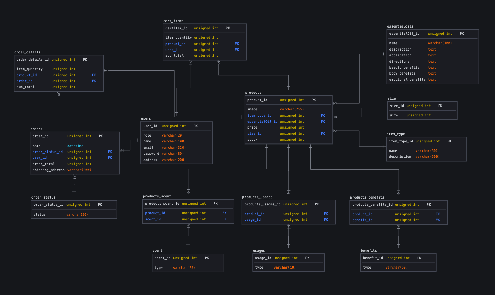
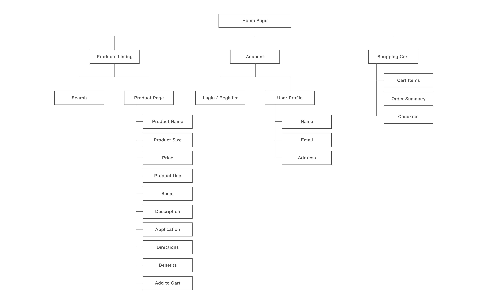
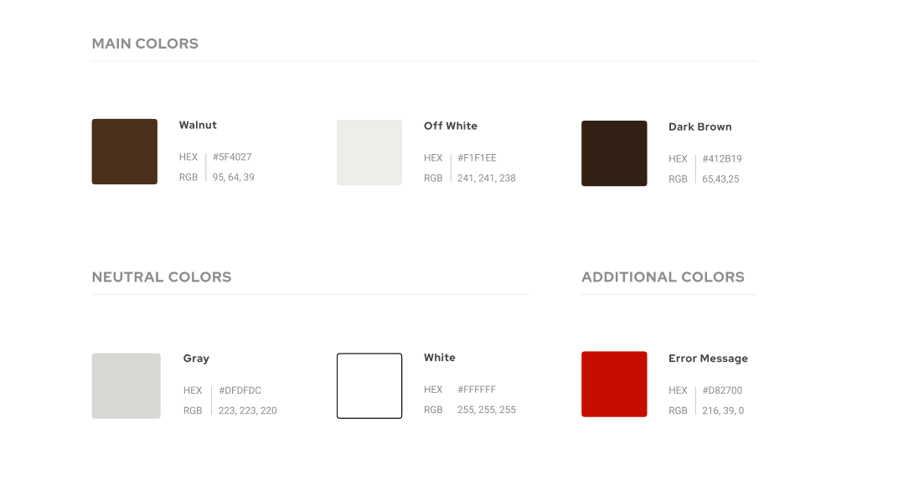

# **Essential Oils Online Store**

**Access the site for customers [here](https://6285c53c8abb231de08e477a--endearing-sfogliatella-c26b89.netlify.app/).**
**Access the site for shop owners (Admin) [here](https://essential-oils-store.herokuapp.com/).**
 
Test Account for Shop Owner
Login: Admin@email.com
Password: admin123

**Credits:**
1. FLO (https://floaroma.sg/) for all product images, information and content used in this project.
2. Young Living (https://www.youngliving.com/en_sg) for all product information.

## 1. Project Summary
### **Background**
An online e-commerce store specialising in the sale of aromatherapy oils (also known as essential oils), focusing on mental and physical health benefits for consumers.

### **Organisational Goals & Project Justification**
* Essential oils have been popular for its use in Aromatherapy and diverse benefits in physical, mental and spiritual health.
* The negative impact on work-life balance has also created anxiety and stress problems among the working-population. Many people are turning to natural therapies as an alternative to conventional drugs.
* Essential oils are well-known to have properties that can aid in a variety of health conditions such as indigestion, cardiovascular disorders, respiratory problems, healing of wounds, relieving stress, alleviating pain, motion sickness etc.
* Thus the main goal of the site is to raise awareness of the types of health benefits that essential oils can provide and promote physical and mental health through the use of essential oil products.

### **Logical Schema Diagram**

 

## 2. UI/UX

### **User Stories**
| User Story                                                                                                                                	| Acceptance Criteria                                                                                                  	|
|-------------------------------------------------------------------------------------------------------------------------------------------	|----------------------------------------------------------------------------------------------------------------------	|
| As a working professional, i would like to look for essential oil remedies to relieve stress, headaches and other physical health issues. 	| Website helps users to search for suitable products based on their health concerns through the use of search filters 	|
| As a health and wellness enthusiast, i would like to get to know more about essential oils and their health benefits.                     	| Website also contains useful information on the types of essential oils, their health benefits and how to use them.  	|

### **5 Planes of UI/UX**
### 1. Strategy
1. **Target Users**: Essential oil users are commonly women but also growing significantly among the millennials or Gen X who are more open to discover the benefits of natural medicine. In additon, working professionals looking into natural remedies for mental / physcial health purposes (e.g. stress, headaches etc), as well as anyone who is interested in general health.
2. **Users Needs**: To easily search and find products that provides the appropriate remedy for their health concerns.
3. **Site Objective**:
    - help users to search for essential oil products based on their needs / health concerns
    - help users to search for essential oil product by usage, scent and health benefits
    - Provide helpful information on the uses and application method of each essential oil

### 2. Scope
1. **Functional Requirements (for customers):**
    - Account registration and login
    - Browse products, search products and view each product and product details
    - add products to shopping cart
    - update quantity of products to purchase in shopping cart
    - remove a product from shopping cart
    - checkout shopping cart and make payment through Stripe
2. **Functional Requirements (for shop owner):**
    - login and register a new shop owner
    - Create product
    - update product details and information
    - delete a product (that does not exist in a user's shopping cart or is being purchased)
    - view listing of all products in the store
    - search products
    - view all orders made by customers, and their order details
    - update order status, and customer's shipping address
    - delete an order
    - search orders
3. **Non-Functional Requirements (for customers):**
    - Mobile responsiveness

### 3. Structure

1. Nav Bar: Allows user to navigate to products listing, profile page / login page / account registration page, and shopping cart.
2. Home Page: Has a CTA button to direct user to product listings
3. Shopping Cart: displays summary of selected products that the user has chosen to purchase.
4. User Login/Register/Profile: Upon clicking on the 'user' icon, user will first be directed to the login page to log in. If user do not have an account, user can register for a new account via the login page. If the user has already logged into the site, user will be directed to their profile page.

### 4. Skeleton
(Draft Wireframe)
Refer to [this link](https://www.figma.com/file/7GpYn05kCnyLd2KHTWCKP5/DWAD-Assignment-3-(Wireframe-Draft-v1)?node-id=4%3A5) for the wireframe of the following pages:
1. Home Page
2. Product Listings
3. Product Page
4. Shopping Cart
5. User Login

### 5. Visual Design
Use of neoclassical serif and minimal light-weight sans serif with simple icons, and muted colour palette to provide an overall clean and elegant UI.

## 3. Features
**For customers:**
1. Customers can view their profile upon login / registration
2. Search filters allows users to search for products based on it's properties and benefits, improving customer experience when browsing for products with the intent of making a purchase.
3. Customers can quickly add a product to the shopping cart from the product listings without clicking to go into the product page.
4. Shopping cart page shows product image, product details and selected quantity - providing customers a clear summary of their selected items to be purcahsed.
5. Customers are also able to navigate from each of their shopping cart item back to it's product page to review the product description again before confirming purchase.
6. Inline updating of shopping cart item quantity. The subtotal and order summary will also be updated instantaneously to reflect any changes in the total amount.

**For shop owners / administrators:**
1. Owners can view their profile upon login, and register a new shop owner or administrator
2. Owners / administrators can view all products and search for products
3. Owners / administrators can create and update a product.
4. Owners / administrators can upload product images for each product.
5. Owners / administrators can delete a product (that does not exist in customer's shopping cart or is not being purchased)
5. Owners / administrators can view all customers orders and their order details.
6. Owners / administrators can update order statuses and customer shipping address
7. Owners / administrators can delete an order.

**Limitations and future implementations (for customer site)**
1. Allow customers to edit/update their profile details (i.e. contact information and address), as currently customers can only view their profile created upon registration.
2. Allow customers to reset their password or registered email.
2. Allow customers to view their order history, order statuses and details of their purchases in their account.
3. Enable sorting of products / product search by alphabetical order, lowest to highest price etc.
4. Implement product variation in a single product page (i.e. bottle size), instead of having separate product pages and requiring the customer to search through all the listings for their preferred product attribute. This would also help to improve customer experience.

**Limitations and future implementations (for owner / admin site)**
1. Allow owners / administrators to also view user accounts and create, edit and delete a user.
2. Product search can be made more efficient by allowing owners / administrators to perform keyword search of products besides filtering.
3. Site owners / administrators can also create, update and delete product categories.

## 4. Technologies Used / Credits
- Built using HTML / CSS / Express / ReactJS
- Database created with MySQL & PostgreSQL
- Knex.js (http://knexjs.org/) & Bookshelf.js (https://bookshelfjs.org/) for building of MySQL query
- Caolan forms (https://github.com/caolan/forms) for creation of forms in admin site
- db-migrate (https://db-migrate.readthedocs.io/en/latest/) for MySQL database migration
- Stripe (https://stripe.com/) for online payment
- Cloudinary (https://cloudinary.com/) for image uploading
- Axios for calling of API
- UI created using Bootstrap (http://getbootstrap.com/) & React Bootstrap (https://react-bootstrap.github.io/)
- Fonts from Google Fonts (https://fonts.google.com/)
- All icons from Bootstrap (https://icons.getbootstrap.com/) & React Icons (https://react-icons.github.io/react-icons/)
- Landing page image downloaded from Freepik ([Source](https://www.freepik.com/free-photo/essential-oil-aroma-diffuser-humidifier-diffusing-water-articles-air_17034921.htm#&position=2&from_view=collections))

**Data Sources**
- All product images, information and content from FLO (https://floaroma.sg/) and Young Living (https://www.youngliving.com/en_sg)

**Deployment**
- Heroku to deploy express application
- Netlify to deploy React application

## 5. Testing

